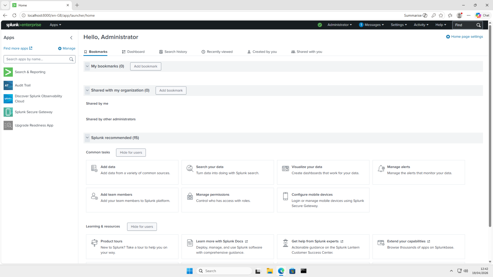
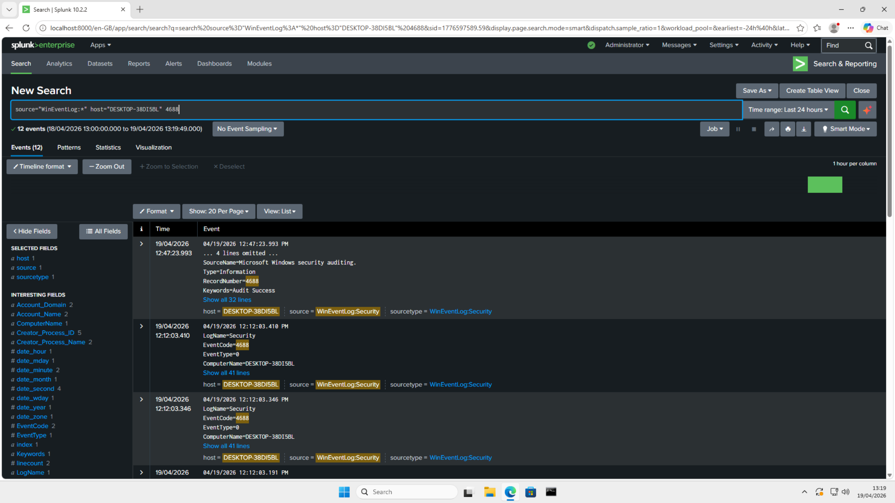

# Phase 2: SIEM Installation (Splunk Enterprise)

## Objective
The goal of this phase is to deploy a central Security Information and Event Management (SIEM) platform to aggregate, index, and analyze security telemetry. For this lab, **Splunk Enterprise** is installed directly on the Windows 11 target to act as the primary analysis engine.

## Splunk Installation
- **Platform:** Windows 11 Pro (VM)
- **Software:** Splunk Enterprise (Free License)
- **Access URL:** `http://localhost:8000`

### Installation Key Steps:
1.  **Service Account:** Splunk was configured to run under a dedicated service account to adhere to the **Principle of Least Privilege**.
2.  **Web Interface:** Verified successful installation by accessing the Splunk Web UI via the local loopback address.

*(Screenshot: Splunk Web UI first look)*

##  Initial Data Verification
A basic search was performed to verify that the Splunk engine is operational. At this stage, only internal Splunk logs are present.

**Initial Search Query:**
`source="WinEventLog:*" host="My host name" 4688`

*(Screenshot: Splunk Search results showing internal log of event code "4688")*

## Technical References
During the analysis phase, the following resources are used to decode complex Windows Event IDs:
- **[Ultimate Windows Security Encyclopedia](https://www.ultimatewindowssecurity.com/securitylog/encyclopedia/default.aspx):** A comprehensive guide for understanding the "Why" and "How" of Windows Security Log events.

---
*Documentation updated as of: April 19, 2026*
