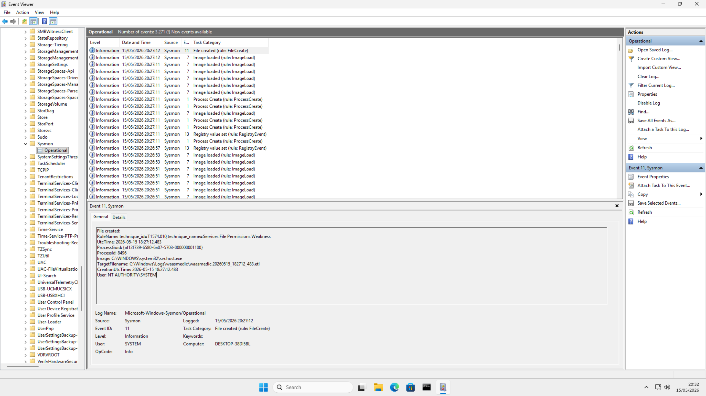

# Phase 3: Endpoint Visibility (Sysmon)

## Objective
To gain deep, high-fidelity visibility into the Windows 11 target, we are deploying **Microsoft Sysmon**. This allows us to track process creation, network connections, and file system changes with much more detail than standard Windows Event Logs.

## 🛠️ Installation & Setup
- **Source:** [Microsoft Sysinternals](https://docs.microsoft.com/en-us/sysinternals/downloads/sysmon)
- **Configuration:** [Olaf Hartong's Sysmon-Modular](https://github.com/olafhartong/sysmon-modular) (A professionally maintained, MITRE ATT&CK-mapped configuration).

### Deployment Command:
`sysmon.exe -i configs/sysmon/sysmonconfig.xml -accepteula`

*(Screenshot: Sysmon events being populated in the Windows Event Viewer after successful installation.)*

## 📊 Key Sysmon Event IDs to Monitor
| Event ID | Description | Why it matters to a SOC Analyst |
| :--- | :--- | :--- |
| **1** | Process Creation | Tracks what programs are running and their full command line. Essential for detecting "Living off the Land" attacks. |
| **3** | Network Connection | Identifies which processes are talking to external IP addresses. Used for C2 detection. |
| **11** | FileCreate | Tracks when new files are created. Detects malware dropping payloads or stage-two tools. |
| **22** | DNS Query | Logs DNS lookups. Vital for spotting DGA (Domain Generation Algorithms) or connections to known bad domains. |

## 📁 Configuration File Analysis: Olaf Hartong (Sysmon-Modular)
**Rating: 10/10 (Industry Standard)**

This configuration is widely considered the "Gold Standard" for several reasons:
1. **MITRE ATT&CK Mapping:** Most rules are tagged with specific ATT&CK techniques (e.g., T1059 for Command and Scripting Interpreter).
2. **Noise Reduction:** It includes extensive "Exclude" rules for common, safe Windows processes that would otherwise flood your SIEM with useless data.
3. **Granularity:** Instead of logging *everything*, it logs specifically what looks suspicious (e.g., PowerShell running with `-enc` or `net.exe` being used to modify users).

**Key Sections in the XML:**
- `<EventFiltering>`: This is the heart of the file. It contains nested `<ProcessCreate>`, `<NetworkConnect>`, etc., tags that define what to include or exclude.
- `onmatch="include"`: Tells Sysmon to log an event if it matches the criteria.
- `onmatch="exclude"`: Tells Sysmon to ignore the event (used for noisy, safe processes).

---
*Documentation updated as of: April 19, 2026*
